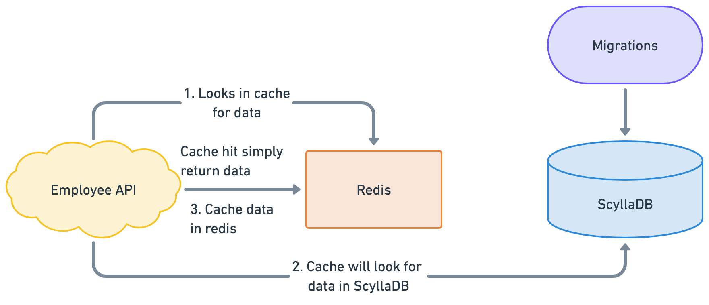

# Employee REST API

Employee REST API is a golang based microservice which is responsible for all the employee related transactions in the [OT-Microservices](https://github.com/OT-MICROSERVICES). This application is completely platform independent and can be run on any kind of platform.

## Pre-Requisites

The application doesn't have any specific pre-requisites except the database connectivity. Additionally, we can add `Redis` as cache system but it's not part of the mandatory setup.

- [ScyllaDB](https://www.scylladb.com/)
- [Redis](https:/redis.com/)

## Architecture

