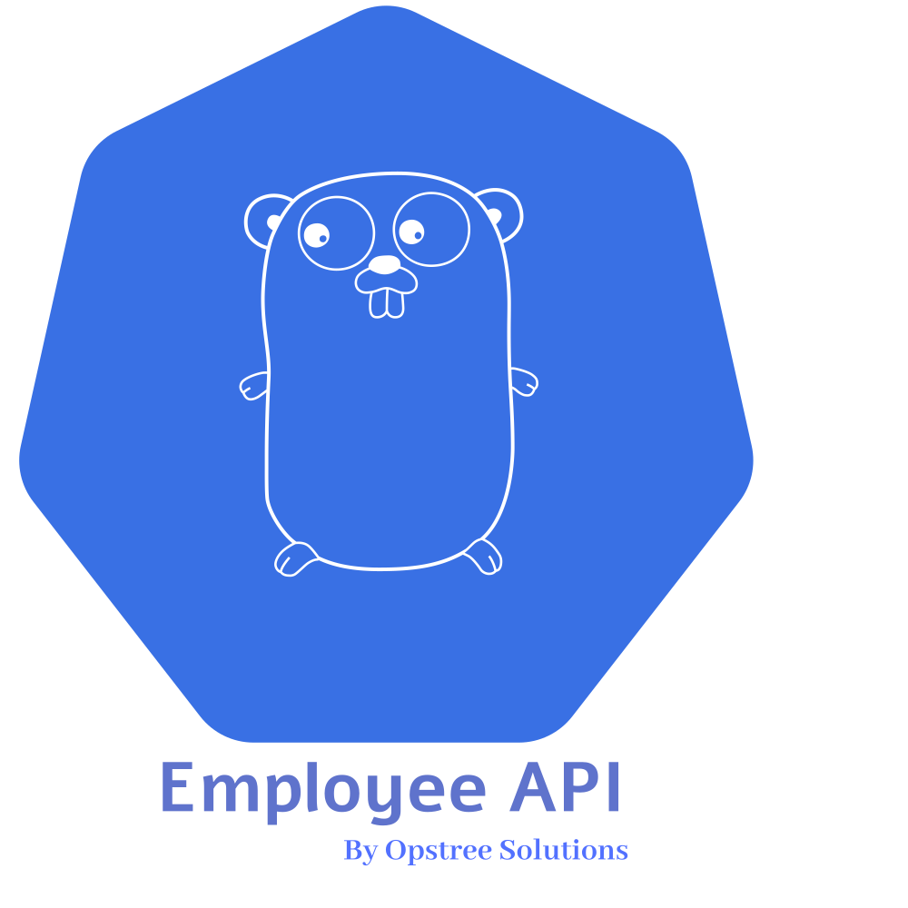

<p align="center">
  
</p>

Employee REST API is a golang based microservice which is responsible for all the employee related transactions in the [OT-Microservices](https://github.com/OT-MICROSERVICES). This application is completely platform independent and can be run on any kind of platform.

Supported features in the applications are:-

- Gin REST API for web transactions
- ScyllaDB as primary database for storing information
- Redis as a cache management system for quick response
- Swagger integration for the documentation of the API
- Prometheus's metrics support to monitor application health and performance

## Pre-Requisites

The application doesn't have any specific pre-requisites except the database connectivity. Additionally, we can add `Redis` as cache system but it's not part of the mandatory setup.

For running the application, we need following things configured:

- [ScyllaDB](https://www.scylladb.com/)
- [Redis](https:/redis.com/)

## Architecture


## Application 

For building the application, we can use `make` command. The same command can be used to build docker image as well.

```shell
make build
make docker-build
```

For execution of the unit test cases, code coverage reports, etc. We can use `go test` command.

```shell
go test $(go list ./... | grep -v docs | grep -v model | grep -v main.go) -coverprofile cover.out
# For HTML report visualization
go tool cover -html=cover.out
```

The test cases are covered for only these packages:-
- api
- client
- config
- middleware
- routes

For dev testing, the [Swagger](https://swagger.io/) UI can be used for sample payload generation and requests. The swagger page will be accessible on http://localhost:8080/swagger/index.html

To run the application, simple binary commands can be used. Before running the application, we have to make sure our mandatory database (ScyllaDB) is up and running. Configuration properties will be configured inside [config.yaml](./config.yaml) file. Also, once the property file is defined and configured properly, we need to run migrations to create database, schema etc. The connection details for migration is available in [migration.json](./migration.json).

```shell
make run-migrations
```

Once the keyspace and table is initialized, we can run the application by:

```shell
export GIN_MODE=release
# For debugging set gin mode to development
./employee-api
```
## Endpoints Information

| **Endpoint**                        | **Method** | **Description**                                                                                   |
|-------------------------------------|------------|---------------------------------------------------------------------------------------------------|
| /metrics                            | GET        | Application healthcheck and performance metrics are available on this endpoint                    |
| /api/v1/employee/health             | GET        | Endpoint for providing shallow healthcheck information about application health and readiness     |
| /api/v1/employee/health/detail      | GET        | Endpoint for providing detailed health check about dependencies as well like - ScyllaDB and Redis |
| /api/v1/employee/create             | POST       | Data creation endpoint which accepts certain JSON body to add employee information in database    |
| /api/v1/employee/search             | GET        | Endpoint for searching data information using the params in the URL                               |
| /api/v1/employee/search/all         | GET        | Endpoint for searching all information across the system                                          |
| /api/v1/employee/search/location    | GET        | Application endpoint for getting the count and information of location                            |
| /api/v1/employee/search/designation | GET        | Application endpoint for getting the count and information of designation                         |
| /swagger/index.html                 | GET        | Swagger endpoint for the application API documentation and their data models                      |

## Contact Information

[Opstree Opensource](mailto:opensource@opstree.com)
